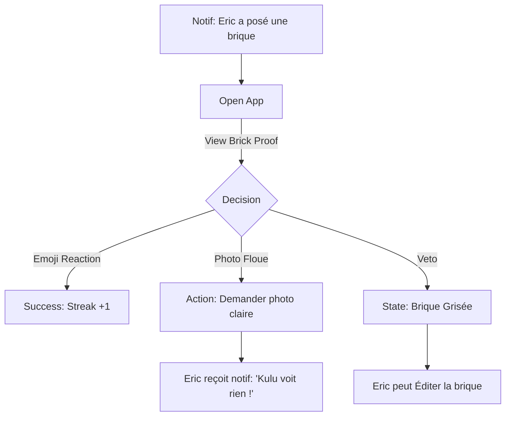

stepsCompleted: [1, 2, 3, 4, 5, 6, 7, 8, 9, 10, 11, 12, 13, 14]
workflowType: 'ux-design'
lastStep: 14
status: 'complete'
completedAt: '2026-01-26'
inputDocuments: ["prd.md", "architecture.md", "product-brief-kulu-cash-2026-01-26.md"]
project_name: 'kulu-cash'
user_name: 'ericson949'
date: '2026-01-26'
---

# UX Design Specification kulu-cash

**Author:** ericson949
**Date:** 2026-01-26

---

<!-- UX design content will be appended sequentially through collaborative workflow steps -->

## Executive Summary

### Project Vision
Transformer la gestion de tontine d'une corvée administrative en un **jeu de construction addictif**. KuluCash n'est pas une interface bancaire, c'est un "Cockpit de Bâtisseur" où chaque versement pose physiquement une pierre à l'édifice de ses rêves.

### Target Users
- **Eric (Le Bâtisseur Solo) :** Besoins de rapidité extrême (marché), de feedback instantané offline, et de fierté visuelle.
- **Marie (La Partenaire Duo) :** Besoins de sérénité, de preuve visuelle sans friction, et de transparence asynchrone ("Trust-Loop").

### Key Design Challenges & Soul
1.  **Mascotte "Striking Kulu" :** Kulu adopte un ton passif-agressif mignon. En cas de retard, il "fait grève" (s'assoit sur le chantier) pour créer une obligation morale ludique.
2.  **Dual Cockpit UI :** Centre de l'écran dédié à l'immersion visuelle (Kulu & Projet) / Périphérie de l'écran dédiée aux KPIs financiers sobres (PRD-compliance).
3.  **Localisms & Tone :** Utilisation d'expressions locales et d'un langage familier/chaleureux pour briser la distance avec l'outil financier.

### Design Opportunities
- **Streaks 🔥 :** Boucle de rétroaction immédiate pour la régularité.
- **Construction Progressive :** Évolution graphique de l'icône projet (herbe -> briques -> toit) pour un sentiment d'achèvement puissant.

## Core User Experience

### Defining Experience (L'Action n°1)
L'action critique est la **Saisie Éclair (10-sec Loop)**. Un utilisateur au milieu d'un marché bruyant doit pouvoir : Ouvrir l'app > Sélectionner le projet > Saisir le montant > Voir Kulu réagir.

**Règle d'Or :** La validation est **locale et immédiate**. L'upload de la preuve (image) se fait silencieusement en arrière-plan ou peut être différé pour ne pas briser le loop de 10 secondes.

### Platform Strategy
- **Priorité :** Mobile-First (Android & iOS).
- **Contrainte Maîtresse :** **Local-Total**. L'app doit simuler un état offline permanent pour garantir la réactivité.
- **Interactions :** Touch-optimized, clavier numérique de type calculatrice à gros boutons.

### Effortless Interactions
- **Kulu's Smart Hint (Auto-fill) :** Lors de l'ouverture du clavier, Kulu suggère le montant attendu (Type B) via une bulle. Un clic sur la bulle remplit automatiquement le champ.
- **Sync Silencieuse :** Passage local -> cloud transparent sans blocage de l'UI (Sync-and-Forget).
- **Shortcut Projets :** Accès direct aux projets actifs depuis le Dashboard avec un minimum de clics.

### Critical Success Moments
- **Rare Kulu Moment :** Animation aléatoire gratifiante immédiatement après un versement.
- **Le Duo "Emoji Wall" :** Possibilité de réagir avec des emojis sur les "briques" (cotisations) posées par le partenaire, transformant la tontine en un flux social positif.

### Experience Principles
1.  **Vitesse Immédiate :** Aucun écran de chargement sur le parcours critique.
2.  **Transparence Radicale :** Visibilité instantanée de sa part vs part du partenaire vs total projeté.
3.  **Encouragement par l'Humour :** Kulu transforme la dette en défi ludique.

## Desired Emotional Response

### Primary Emotional Goal
**La Fierté du Bâtisseur.** L'utilisateur doit ressentir une excitation tangible en voyant son projet progresser visuellement après chaque versement, transformant une obligation financière en un succès concret.

### Emotional Journey Mapping
- **Découverte :** Amusement face à la personnalité de Kulu.
- **Saisie (Marché) :** Sérénité procurée par une interface sub-seconde et 100% offline.
- **Récompense :** Joie via les "Rare Moments" (animations gratuites).
- **Incident (Retard) :** Culpabilité Ludique (Kulu fait grève) -> Motivation à régulariser.

### Micro-Emotions
- **Confiance :** Renforcée par la visibilité totale des calculs et des preuves dans le mode Duo.
- **Connexion :** Sentiment de construire ensemble grâce aux réactions emojis sur chaque brique.

### Design Implications & Principles
- **Mascotte Expressive :** États visuels de Kulu (Triste, Boudeur, En fête) pour refléter l'état de la tontine.
- **Évolution Épique :** Les paliers de tontine doivent être marqués par des changements graphiques majeurs sur le projet.
- **Zéro Anxiété :** Ne jamais utiliser de rouge punitif, préférer des tons "terrains" (terre, briques, or) et des messages d'encouragement.

## UX Pattern Analysis & Inspiration

### Inspiring Products Analysis
- **Duolingo (Gamification) :** Maîtrise des micro-animations de mascotte et des boucles de "Streaks" 🔥 pour maintenir l'engagement quotidien.
- **Revolut / Wave (Fintech Clarity) :** Standard de l'industrie pour la lisibilité des transactions et la mise à jour instantanée des soldes.
- **Forest (Visual Building) :** Utilisation de la croissance d'un objet (arbre) pour symboliser le succès d'une discipline sur le long terme.

### Transferable UX Patterns
- **Progressive Disclosure :** Masquage de la complexité mathématique du moteur Type B. Affichage prioritaire du "Prochain Versement", avec option de déplier pour plus de détails.
- **Haptic Gratification :** Utilisation de retours haptiques (vibrations discrètes) lors d'actions réussies (pose de brique, validation Duo).
- **Gamified Progress Bar :** Remplacement de la barre de progression linéaire par une icône de projet qui se construit physiquement (ex: briques par briques).

### Anti-Patterns to Avoid
- **The Financial Data overload :** Éviter les grilles de chiffres denses qui rappellent un tableur Excel.
- **Network Dependency Indication :** Éviter les "Loading Spinners" bloquants; l'interface doit rester interactive par défaut via l'état local.

### Design Inspiration Strategy
- **Adopter :** Le tempérament et l'expressivité de Duolingo (via Kulu).
- **Adapter :** La rigueur de Revolut pour le cockpit analytique, avec une esthétique plus chaleureuse et organique.
- **Éviter :** La rigidité et la froideur des applications de banque traditionnelles.

## Design System Foundation

### Design System Choice
**Custom "Kulu-First" Design System.** Nous bâtissons nos propres briques (atomes et molécules) au-dessus de React Native.

### Rationale for Selection
KuluCash n'est pas une application de gestion classique; c'est une expérience immersive de construction. Les bibliothèques Material ou iOS standards briseraient l'analogie du "Chantier" et le caractère insolent de Kulu. Un système sur-mesure permet d'injecter des textures (terre, briques, dorure), des micro-vibrations haptiques et des animations physiques impossibles avec un kit prêt-à-porter.

### Implementation Approach
- **Base :** React Native StyleSheet + Expo Local Authentication (Biométrie).
- **Animation Engine :** `React Native Reanimated 3` pour les mouvements fluides de Kulu et les transitions de construction.
- **Iconography :** Set d'icônes personnalisé (symbolisme construction/maison) complété par `Lucide React Native` pour les utilitaires.

### Customization Strategy (The Skin Engine)
Mise en place d'un `ThemeProvider` central basé sur des Design Tokens (ex: `colors.primary`, `spacing.market_friendly`). Cette structure est indispensable pour supporter techniquement les "Skins" débloqués par les Streaks (ex: Kulu Noël, Kulu Chef de Chantier).

## 2. Core User Experience

### 2.1 Defining Experience
**"Poser sa pierre instantanément."** L'expérience se définit par la transformation d'un virement abstrait en un acte de construction physique. L'utilisateur ne "paye" pas, il "bâtit". C'est l'émotion de voir un muret devenir une maison qui constitue l'âme de l'app.

### 2.2 User Mental Model
Les utilisateurs passent d'un modèle de **"Dette de Tontine"** (perçu comme un fardeau) à un modèle de **"Placement Progressif"**. Ils amènent l'habitude du suivi manuel ("le carnet") mais s'attendent à ce que le numérique soit plus gratifiant et moins faillible.

### 2.3 Success Criteria
- **Rapidité Perçue :** Feedback visuel/haptique sub-200ms après la saisie du montant.
- **Transparence Duo :** Visibilité en temps réel de la brique posée par le partenaire (Emoji Reactions).
- **Gratification Addiction :** 100% des versements déclenchent une micro-animation de Kulu.

### 2.4 Novel UX Patterns
- **Building Dashboard :** L'écran d'accueil n'est pas une liste financière froide, c'est une scène vivante (le projet) qui évolue graphiquement.
- **Kulu's Strike state :** Un pattern asymétrique où l'interface change d'aspect (plus sombre, Kulu boudeur) tant qu'un retard n'est pas régularisé.

### 2.5 Experience Mechanics
- **1. Initiation :** Bouton flottant (Fab) "🧱 Poser pierre" ou suggestion active de Kulu via bulle de dialogue ("C'est ton tour !").
- **2. Interaction :** Saisie simplifiée via pavé numérique "Soft-Touch" à gros boutons, auto-complétion intelligente du montant attendu.
- **3. Feedback :** Double gratification : Vibration haptique simulant un choc de brique + Son de mortier court + Animation de Kulu qui s'exclame.
- **4. Completion :** Mise à jour du solde total et du compteur de Streak, suivi par le passage à la vue "Récit" (Historique visuel).

## Visual Design Foundation

### Color System (Palette "Chantier & Cash")
- **Primary (Kulu Gold) :** `#FFC107` – Interaction et succès.
- **Secondary (Terra Cotta) :** `#D35400` – Construction et briques.
- **Cash Accent (Emerald Green) :** `#2ECC71` – Utilisé exclusivement pour les montants positifs, soldes épargnés et gains, pour symboliser la richesse.
- **Surface (Deep Slate - Default) :** `#1A1C1E` – **Dark Mode par défaut** pour maximiser le contraste en extérieur et économiser la batterie.

### Typography System
- **Tone :** Chaleureux et lisible.
- **Titres & Chiffres :** **"Outfit Bold"**. Utilisation systématique du gras pour les montants financiers afin de garantir une lisibilité totale en plein soleil (marché).
- **Corps de texte :** **"Inter"** pour les textes longs et labels secondaires.

### Spacing & Layout (Market-Friendly)
- **Base Unit :** `12px` (système de grille aéré).
- **Touch Targets :** Minimum 48dp pour tous les boutons d'action.

### Tone & Langage (The Kulu Library)
- **Kulu-ismes :** Mise en œuvre d'une bibliothèque de proverbes locaux et expressions détournées (ex: "Ton poulailler est vide, mon frère !"). Les messages de Kulu tournent de manière aléatoire pour maintenir la surprise.

## Design Direction Decision

### Design Directions Explored
Nous avons exploré 4 axes : "Le Voyage" (aventure illustrée), "Le Chantier" (isométrie ludique), "Le Cockpit Premium" (Fintech Dark/Elite) et "Le Hub Social" (clean/community).

### Chosen Direction
**Option 3 : Le Cockpit Premium (Fintech Dark).** 

### Design Rationale
Cette direction a été choisie pour sa capacité à rassurer l'utilisateur sur la précision financière du moteur de tontine tout en offrant une esthétique moderne et luxueuse. L'usage du noir profond (`Deep Slate`) avec des accents vert émeraude (`Emerald Green`) et or (`Kulu Gold`) crée un contraste saisissant, idéal pour la lecture en plein soleil. Ce choix permet également de magnifier l'aspect "Mascotte" de Kulu qui ressort comme un bijou au centre de l'interface.

### Implementation Approach
- **Visual Weight :** Épuré, centres d'intérêt focalisés sur les soldes et Kulu.
- **Glassmorphism :** Utilisation de cartes semi-transparentes sur le fond `Deep Slate`.
- **Gradients :** Flux de données symbolisés par des dégradés du vert à l'or pour signifier la croissance de l'épargne.

## User Journey Flows

### 🧱 1. Le Versement Éclair (Le "10-sec Market Loop")
Comment Eric pose sa pierre au milieu du bruit.
- **Entry :** Bouton flottant "🧱" sur le Dash.
- **Logic :** Saisie immédiate, validation locale (Offline-first).
- **Gratification :** Son de mortier et vibration instantanée.
- **Background :** Ajout de la preuve optionnel mais encouragé par Kulu plus tard.

### 🤝 2. La Boucle de Confiance (Duo Trust-Loop & Veto)
Comment Marie valide ou conteste le travail d'Eric.

**Règle de Veto :** Toute brique contestée devient visuellement opaque (grise). Eric conserve le droit d'**éditer** cette brique (changer montant ou photo) pour lever le litige sans détruire l'historique financier.

### 🐢 3. L'Onboarding (L'Éclosion de Kulu)
Un départ mystérieux pour une loyauté durable.
- **Stage 1 :** L'utilisateur arrive sur une interface "Chantier Vide".
- **Stage 2 :** Création du premier projet avec un "Œuf d'Or" au centre.
- **Stage 3 :** Lors du **Premier Versement**, l'œuf éclôt : Kulu apparaît avec sa personnalité insolente.
- **Stage 4 :** Kulu guide l'utilisateur pour sa première invitation Duo.

### Journey Patterns
- **"The 2-Tap Rule" :** Aucune action vitale (payer, voir solde) ne doit prendre plus de 2 actions.
- **Notification Gamifiée :** Les push ne disent pas "Transaction reçue" mais "Kulu a faim de briques !"

## Component Strategy

### Design System Components
Utilisation des couches atomiques de React Native (View, Text, Pressable) stylisées via les tokens "Premium Fintech Dark".

### Custom Components (Kulu Toolbox)
1.  **🧱 L'Atome "Brique de Projet" :**
    - **Usage :** Visualisation unitaire d'un versement.
    - **Logic :** État (`Confirmé`, `Offline`, `Contesté`) piloté 100% par la donnée.
2.  **🥚 Le "Hatching Egg" (Lottie) :**
    - **Usage :** Animation pivot de l'onboarding. Utilise **Lottie** pour une qualité cinéma lors de la naissance de Kulu.
3.  **📂 L'"Evidence Vault" :**
    - **Usage :** Tiroir (Bottom Sheet) coulissant permettant de swiper les preuves (images) pour validation Duo sans quitter le cockpit.
4.  **⌨️ Le "Market Numpad" :**
    - **Usage :** Pavé numérique haute rapidité avec bouton "Suggest" (Auto-fill).
5.  **✨ Le "Duo Pulse" :**
    - **Usage :** Halo lumineux autour de l'avatar du partenaire indiquant une activité temps réel, renforçant le sentiment de "Bâtir ensemble".

### Component Implementation Strategy
- **Isolation :** Chaque composant custom vit dans `src/shared/components` ou `src/features/*/presentation/components`.
- **Data-Driven :** Aucun composant ne gère son propre état financier; ils ne font que refléter les `props` passées par la couche application.

### Implementation Roadmap
- **Phase 1 (Core) :** Dark Theme + Market Numpad + Briques de Projet (états simples).
- **Phase 2 (Social & Onboarding) :** Evidence Vault + Duo Pulse + Hatching Egg animation.
- **Phase 3 (Refinement) :** Micro-animations de Kulu (Reanimated 3) + Textures PBR pour les briques.

## UX Consistency Patterns

### Button Hierarchy (The Soft-Touch Law)
- **Primary Action (🧱 Poser brique) :** Bouton `Gold` plein. Déclenche une vibration haptique "Heavy" + Son "Stone impact".
- **Secondary Action (Détails) :** Bouton `Terra Cotta` outline. Aucune animation sonore.
- **Critical Action (Veto/Cancel) :** Bouton plat (Ghost), feedback visuel d'ombre portée au tap.

### Feedback Patterns (Sensory Feedback)
- **Success Financier :** État par défaut **"Bruyant"**. Sonnerie courte (Kulu exulte) + Vibration prolongée.
- **Success Social (Reaction) :** Vibration courte "Light" uniquement.
- **Erreur/Refus :** Vibration double (pulsée) + Changement d'expression faciale de Kulu instantané.

### Form Patterns (Input Isolation)
- **Saisie Numérique :** Utilisation exclusive du **Market Numpad** custom pour les montants. Le clavier système est bloqué pour éviter les latences de chargement.
- **Saisie Texte :** Clavier système standard (uniquement pour noms de projets ou messages).
- **Validation :** Toute saisie financière nécessite une double confirmation tactile (Tap à l'écran).

### Navigation Patterns (The Project Anchor)
- **Header Permanent :** Le projet sélectionné reste ancré en haut de l'interface (`Project Anchor`). Tap sur l'ancre pour revenir au Dashboard du projet.
- **Contextual Back :** Le bouton retour change de forme pour devenir un bouton "Quitter Chantier" lors de la saisie d'un versement.

## Responsive Design & Accessibility

### Responsive Strategy (Mobile-Only MVP)
- **Focus :** Optimisation exclusive pour **Mobile Portrait**. Pas de support Tablette/Desktop pour le MVP afin de garantir une expérience à une main parfaite.
- **Sun-Test Protocol :** Toutes les vues critiques (Dashboard, Saisie) sont testées sous une simulation de forte luminosité.

### Accessibility Strategy (WCAG AA)
- **Contrast Control :** Utilisation de bordures blanches ou or (`Highlight`) autour des éléments grisés (veto) pour garantir leur visibilité sur fond sombre en extérieur.
- **Visual Flash :** En complément du son et de la vibration, l'écran émet un bref flash lumineux lors de la validation d'un versement pour confirmer l'action visuellement en milieu bruyant.
- **Touch Targets :** Respect strict du 48x48dp pour les zones interactives.

### Resource & Battery Management
- **Battery Saver Mode :** Désactivation automatique des animations Lottie et Reanimated complexes si la batterie du téléphone passe sous les 10%, préservant les fonctions financières vitales.

### Implementation Guidelines
- Utiliser les APIs `Haptics` d'Expo pour les vibrations.
- Implémenter des `aria-labels` sur toutes les animations émotionnelles de Kulu.
